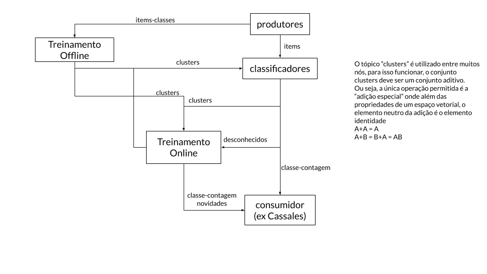

1010.1110
3210-1234
8421-248F

            (stateless)
examples -> classify    |-> class ->          |-> (final eg: Cassales)
           |            |-> no class -> minas |
clusters ->|                            (unkBuff, sleep, novelty)->
                                                            <-------
kafka reader group

medir e explicar

Dask é mais lento para o cálculo de distâncias, provavelmente pelo overhead de 'rede'.
Qual o tamanho desse overhead, ou seja, para até qual tamanho de item/clusters isso é válido (inflection point)?

## Reunião 2019-06-03

Número de brokers, por que 3 (ou mais de um)?
Era só um exemplo.

Montar um projeto da arquitetura com diagrama dos streams.

Exemplo de código com tempos de 1 consumidor até N

Como outros constroem projetos com kafka?

### Testes de Velocidade

#### Produtor

A cada iteração, gera novo item aleatório, evia o item para o tópico `items` e,
o item com a classe correta para o tópico `items_raw`. Além disso verifica o tempo
em nanosegundos e caso a janela de relatório tenha sido alcançada, calcula e mostra o mesmo.

Com 0.01s delay entre items e relatório a cada 2s:

    2.0020 s,  1009 i, 504.00 i/s, 1.98 ms/i, 7.9 kB/s

Sem delay entre items e relatório a cada 10s:

    10.0000 s, 24824 i, 2482.39 i/s, 0.40 ms/i, 38.8 kB/s
